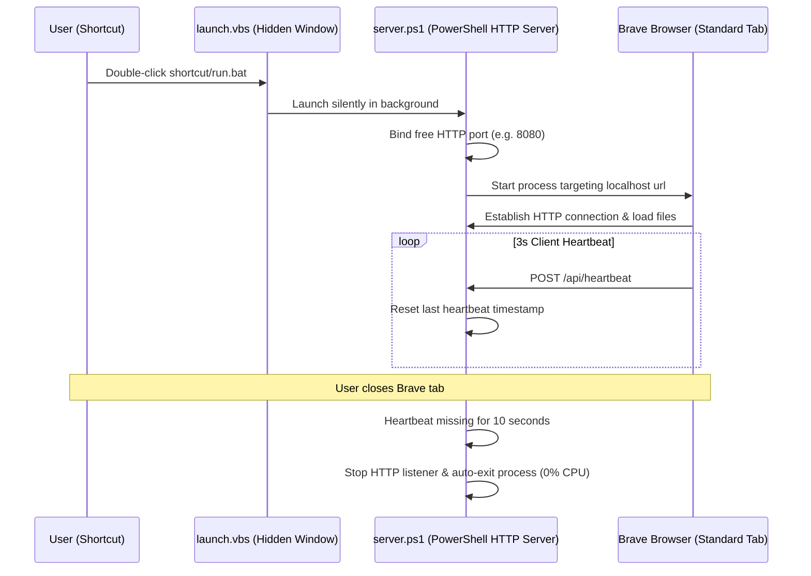

# APEX//DENSITY 
> **High-Density Personal & Semester Matrix Planner**

`APEX//DENSITY` is a zero-dependency, local-first, high-density dashboard built for productivity and semester management. It is designed to run instantly as a lightweight background service, delivering a distraction-free environment directly inside your standard Brave Browser.

---

## 🚀 Key Features

### 📅 High-Density Habit Matrix
* **Timeline Grid**: Auto-maps day columns (1–31) and weekdays for months between July 2026 and December 2027.
* **Custom Scheduling**: Configure habits to track daily or on custom days. Off-schedule days are visually blacked out and locked.
* **Immutable Past & Future Lock**: Yesterday's checkboxes are frozen to preserve log integrity, and future checkboxes are locked to prevent marking ahead.
* **Active Day Highlight**: Today's active column glows with curved neon borders and custom checkbox styling.

### 🎓 Academic Study Sheet
* **Double Preparation Trackers**: Real-time progress sliders for both Midsem and Endsem studies.
* **Inline Exam Countdowns**: Click the edit pencil icon (`✎`) next to any subject to set exam dates in `DD-MM-YYYY` format. Dynamic countdown badges (`In 14d`, `TODAY`, `Passed`) update instantly.
* **Scoreboard & Completion rate**: Ranks your top 10 habits dynamically by completion rate for the selected month.

### 📋 Project & Backlog Tracker
* **Progress Sliders**: Slide tasks from 0% to 100% with immediate status changes.
* **Custom Categories**: Inline editable tags to sort tasks by category.

### 📂 Academic Hub & Media Uploader
* **Fullscreen Timetable Viewer**: Upload files (like timetables or screenshots). Converts images to base64 and displays them in a high-contrast fullscreen overlay modal.
* **Fast-Launch Bookmarks**: Store quick-launch URLs for slides, portals, and grades.

### 📝 Auto-Saving Monospace Notepad
* **Monospace Editor**: A dark code-style textarea that auto-saves your logs locally.
* **Dynamic Tab Groups**: Create tabs with `+`, select active notes, rename tabs with the pencil icon (`✎`), and delete tabs instantly.

---

## 🛠 Architectural Workflow

The application operates as a zero-dependency local wrapper, leveraging native Windows tools to bypass heavy runtimes (Node, Python, Electron).



---

## 💻 Setup & Sharing Guide

### Option A: Standard Folder Clone (Recommended)
1. Clone this repository to your computer:
   ```bash
   git clone https://github.com/Srinivas1610/APEX-DENSITY.git
   ```
2. Double-click **`run.bat`** to start the application instantly in Brave Browser.

### Option B: Single-File Portable Bundle
We have bundled all files (HTML, CSS, JS, scripts, icons) into a single, base64-encoded hybrid batch installer:
👉 **`ApexPlanner_Portable.bat`**
* Simply share this single file with your friends (via WhatsApp, Email, or USB).
* When they double-click it, it automatically extracts the directory structure and starts the app instantly.

---

## 📌 Pinning to Windows Taskbar
Standard script files are blocked from taskbar pinning by Microsoft security rules. To bypass this, the launcher generates a Desktop Shortcut formatted as an Explorer wrapper:
1. Right-click the **`Apex Planner`** shortcut on your Desktop (or inside your Start Menu folder).
2. Select **"Pin to taskbar"**.
3. It will pin with your custom icon and load standard Brave Browser tabs at a single click.

---

## 📂 Repository Structure
```
├── launcher/
│   ├── Launcher.cs      # C# Native hotkey trigger source
│   ├── Launcher.cpp     # C++ Native Window Class finder source
│   └── build.bat        # MS Build script
├── index.html           # Main Application UI Markup
├── style.css            # Custom Styling System
├── app.js               # Core Controller, Timers, Calendars & Rendering
├── server.ps1           # Native HTTP server & data persistence API
├── launch.vbs           # Silent background window manager
├── run.bat              # Zero-dependency startup script
└── favicon.ico          # Custom application icon
```

---

## 📝 License
Created and maintained for high-density academic and personal planning. Open source and free to distribute.
